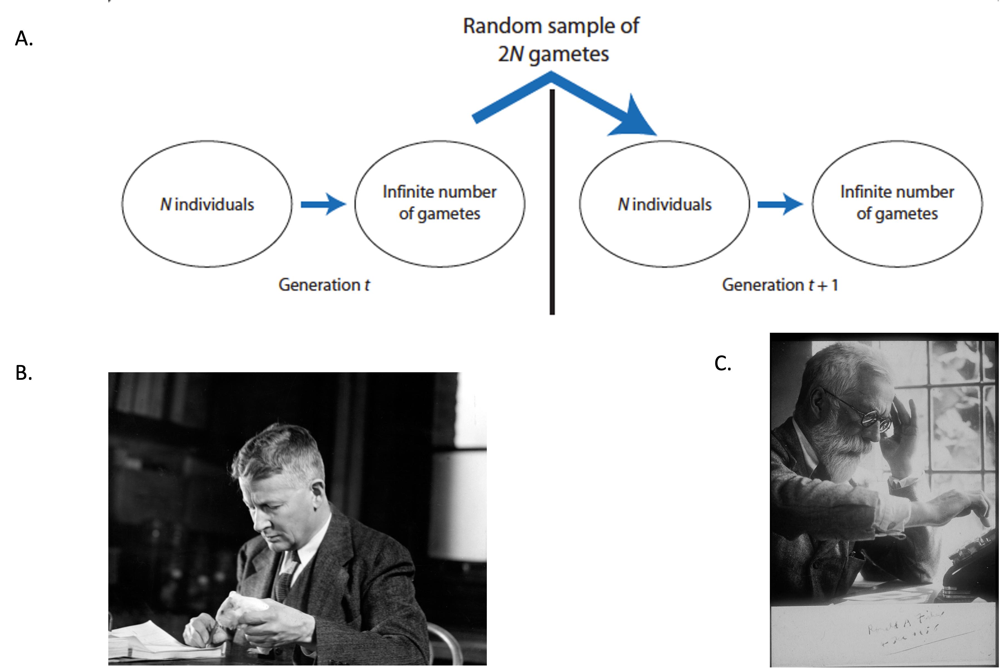

# Pre-Requisites
  * [Wright-Fisher Model](https://stephens999.github.io/fiveMinuteStats/wright_fisher_model.html)
  * [Discrete Markov Chains](http://stephens999.github.io/fiveMinuteStats/markov_chains_discrete_intro.html)
  * Basic notions of probability theory
  * Basic notions of population genetics
  

# Genetic Drift in Finite Populations

Much population genetic theory concentrates on describing the changes of allele frequencies through time. The two most important factors influencing allele trajectories through time are natural selection and **genetic drift** [1]. In these vignettes, we will focus on genetic drift and how this process may be modeled as a [stochastic process](https://en.wikipedia.org/wiki/Stochastic_process) in a [Wright-Fisher population](https://stephens999.github.io/fiveMinuteStats/wright_fisher_model.html).
  
Genetic drift is the random change of allele frequencies through time in populations of finite size [1,2]. Different random processes could affect the outcome of genetic drift, and they might have nothing to do with the individuals' fitness [1]. For example, some individuals may die before they reach reproductive age because of extrinsic effects not related to their genetic makeup [1]. Additionally, there is inherent randomness in Mendelian segregation, and these effects could become more apparent when populations are small (we will shortly see why this is the case) [1,2].  


# Brief Introduction to a Wright-Fisher Model 

Before delving into the specific probabilistic models of genetic drift, it is important to summarize the main basic assumptions of the Wright-Fisher population. The Wright-Fisher population is an idealized biological scenario where the models of genetic drift are useful to describe allele frequencies changes due to random sampling error [1]. Although the Wright-Fisher model is biologically unrealistic, it has been extremely useful to model genetic drift (and other evolutionary processes) in a relatively simple fashion [1]. Some of the basic assumptions of the Wright-Fisher model include [1]:

  * discrete, non-overlapping generations
  * numbers of females and males are equal
  * size of population ($N$ individuals ) remains constant through time and is finite
  * no natural selection (all individuals are equal in their production of gametes and all gametes are equally viable)
  * infinite pool of gametes
  * finite sample of $2N$ alleles is drawn from the gamete pool to form the next generation of $N$ individuals 
  * the sampling errors that originate genetic drift occur when the $2N$ alleles are drawn from the population´s gamete pool
  
<center>


\begingroup
\fontfamily{ppl}\fontsize{12}{16}\selectfont
Figure 1. **A.** Schematic of the Wright-Fisher model. Sampling error -and genetic drift-, happens in the random draw of gametes from  generation $t$ to generation $t+1$. _Image from Hamilton, M.B. (2008)_ **B.** Sewall Wright (undated) with a guinea pig as a professor at the University of Chicago. _University of Chicago Photographic Archive, [apf digital item number, e.g., apf12345], Hanna Holborn Gray Special Collections Research Center, University of Chicago Library._ **C.** Ronald Fisher at his calculator in 1958 _(Fisher Memorial Trust)_.
\endgroup
</center>
  


# Models Used to Describe Genetic Drift (No Mutation and/or Selection)

In this section of the vignette, we will introduce three basic models that can be used to analyze properties of genetic drift:
  
  * Binomial distribution  
  * Markov chain
  * Diffusion process (continuous time approximation to the Markov chain)  

### Binomial Distribution  

To understand genetic drift of a single two-allele locus in a Wright-Fisher population, we must first get into the details of an important discrete probability distribution: **the binomial distribution.**  
A binomial distribution is a discrete probability distribution that defines the probability distribution for the sum of $N$ independent samples of a Bernoulli variable [1]. In terms of two alleles $A$ and $a$ and to describe the sampling of alleles from a gamete pool of a N individuals population, the following formula is useful:  

$$
P_{i=A}={2N \choose i}p^{i}(1-p)^{2N-i} \\
$$
This formula describes the probability of sampling $i$ $A$ alleles in a sample of $2N$ alleles from a population where the $A$ allele has a frequency of $p$ and the alternate $a$ allele has a frequency of $1-p$. The $p^i$  and $(1-p)^{2N-i}$ terms estimate the probability of observing a $i$ and $2N-i$ independent events each with probability $p$ and $1-p$, respectively [1].  With some knowledge of the properties of the binomial probability distribution, we can realize that the Wright-Fisher model is a very good approximation to model genetic drift [1]. Some of the properties of the Bernoulli random variables will helps to better understand some specific behaviors of allele frequencies under the action of genetic drift. Some of these properties are:  

$$
\sigma^2=p(1-p) \space \mathbb{for \space a \space single \space Bernoulli \space variable} \\
\mathbb{SE(standard \space error)}=\sqrt{\frac{2p(1-p)}{2N}} \\
\mathbb{Additionally, we \space can \space also \space write \space formulas \space in \space terms \space of \space conditional \space expectation \space and \space conditional \space variance:} \\
\mathbb{E}(p_{t+1}|p_t)=p_t \\
\mathbb{Var}(p_{t+1}|p_t)=\frac{p_t(1-p_t)}{2N} \\
p_{t}= \mathbb{frequency \space allele \space A \space in \space generation \space t} \\
p_{t+1}= \mathbb{frequency \space allele \space A \space in \space generation \space t+1}\\
$$

 As we may infer from the formulas, the maximum variability in the outcomes of the alleles' sampling process will occur when **the frequency $p$ of $A$ equals the frequency $1-p$ of $A$ ($p=1-p=0.5$)**[1]. This makes intuitive sense because as the frequency of one of the alleles reaches fixation , the sampling error that results in greatly increased frequencies of the low-frequency allele in one generation will be very highly unlikely [1]. On the other hand, when both alleles are equally frequent or almost equally frequent, sampling error is equally likely to increase or decrease allele frequency and its outcomes could vary more widely along the spectrum of possible allele frequencies.  
  
  
The following code will demonstrate how the variability of the outcomes of the sampling process depends,in part, to : 


```{r,message=FALSE}
library(tidyverse)
# Vector of allele frequency for allele A
p <-  seq(0,1,by=0.01) # Frequency p of A allele
N <- 100 # Population of N individuals
# vector to store standard errors


fun_p <- function(p,N){ # function to estimate the standard errors for each frequencies
  se <- c()
  for(i in 1:length(p)){
    se[i] <- sqrt((p[i]*(1-p[i]))/(2*N))
  }
  return(se)
}


SE <- fun_p(p=p,N=N)

df <- cbind(p,SE)
df <- as.data.frame(df,col.names=names("p","SE"))

# Plot of Allele Frequency p vs Standard Error
ggplot(df,aes(x=p,y=SE))+geom_line()+xlab("Allele Frequency p")+ylab("SE")+ggtitle("Allele Frequency vs Standard Error")+theme(plot.title = element_text(hjust = 0.5))+geom_hline(yintercept = max(SE),color="red")

#The horizontal red line determines the maximum value of SE.
```

The above plot confirms what we just discussed. The maximum variability of allele frequency changes happens when both alleles are very close in frequency[1].  

Another feature affecting the variability of sampling errors in genetic drift is the **population size**. As population size increases, the variability of allele frequencies becomes less and less, constraining the spectrum of possible changes in allele frequencies moving forward in time and reducing the variance of the sampling error process.  

The following code will illustrate this:  

```{r}

p <- 0.5 # Set the p frequency to 0.5

N <-seq(10,100,by=10) # Create the N vector

fun_p <- function(p,N){ # function to estimate the standard errors for each population size
  se <- c()
  for(i in 1:length(N)){
    se[i] <- sqrt((p*(1-p))/(2*N[i]))
  }
  return(se)
}

SE <- fun_p(p=p,N=N)

df <- cbind(N, SE)
df <- as.data.frame(df,col.names=names("N","SE"))

# Plot of Allele Frequency p vs Standard Error
ggplot(df,aes(x=N,y=SE))+geom_line()+xlab("Population Size (N)")+ylab("SE at p=0.5")+ggtitle("Population Size vs Standard Error at p=0.5")+theme(plot.title = element_text(hjust = 0.5))+geom_hline(yintercept = max(SE),color="red")

#The horizontal red line determines the maximum value of SE.


```

Both features (population size and allele frequencies at time $t$) will be of paramount importance to determine the outcomes of genetic drift in a given Wright-Fisher population.  


### Markov Chain

The Markov chain model of genetic drift will be explained in the following [vignette]().


### Diffusion Process (Continuous time approximation of the Markov chain model)


The diffusion process model of genetic drift will be explained in the following [vignette]().


