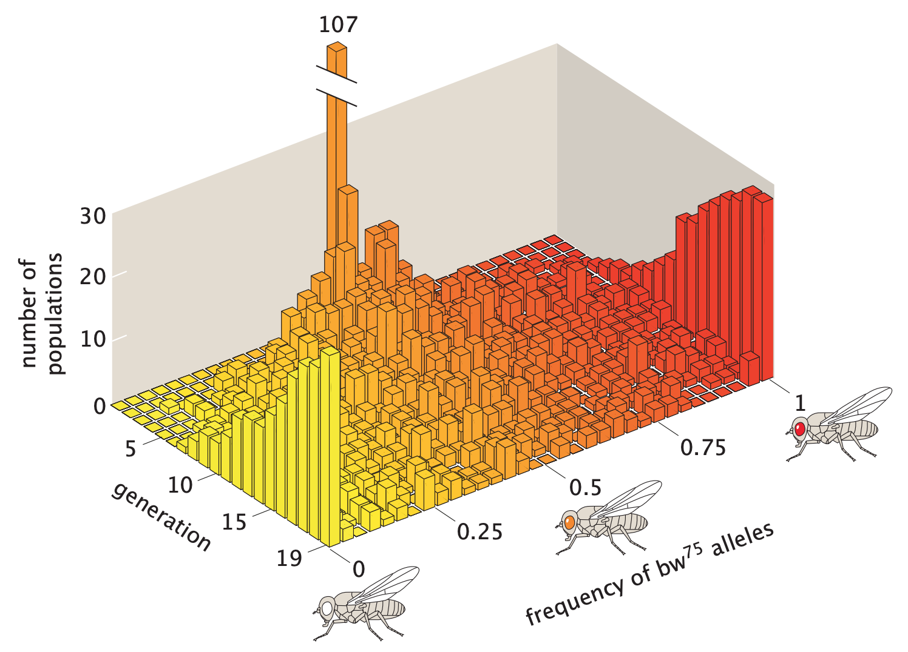
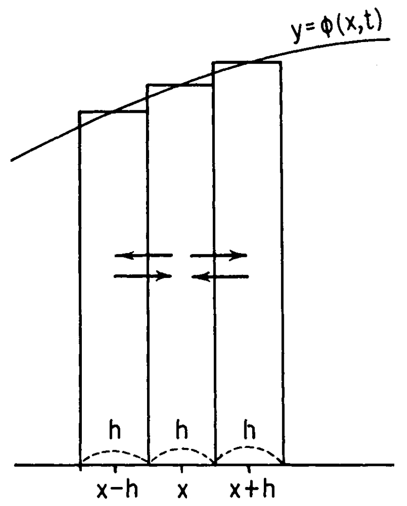

```{r setup, include=FALSE}
knitr::opts_chunk$set(echo = TRUE)
```

While the previous vignette provides a mathematically satisfactory (without invoking advanced concepts beyond calculus) derivation of the Kolmogorov forward/backward equation for time-homogenenous diffusion process, it doesn't convey too much intuition. In this vignette, we will study the classic example of using diffusion process to approximate genetic drift (Kimura 1955). As we will see, not only does it provide an appealing model for continuous variations of allele frequency, it also offers an intuitive justification of the Kolmogorov forward equation.

### Prerequisites

* **A good understanding of the material in previous vignettes**
* **Able to reason continuous variation and infinitesimal changes**

### Introduction

The term **diffusion** refers to the general phenomenon where particles move from a high concentration region to a lower concentration region. In genetic drift, we use diffusion to describe the “flattening” effect of random drift on the allele state distributions. In 1956, Peter Buri used a [beautiful experiment](https://www.jstor.org/stable/2406998?seq=1) to demonstrate this effect. Briefly, Buri began the experiment with 107 populations of D. melanogaster (fruit fly). In each population, the frequency of a target allele called $\text{bw}^{75}$ is exactly 0.5. Buri tracked the allele frequency changes over 19 generations by inferring the genotype of each fly from its eye color. The changes in allele frequency distribution vividly describe the effect of genetic drift on many populations.

```{r, echo=FALSE, out.width = '50%',fig.align='center'}

```

In the picture above, all the masses are initially concentrated at the center. In a few generations, the masses spread out fairly evenly. As time passes, some alleles reach fixation and some are driven out of the population.

### Derivation of forward equation

In fact, compared to our derivation, Kimura's intuitive justification applies to a broader class of diffusion processes, in that it doesn't assume time-homogeneity.\
\
Consider a locus with a pair of alleles $A_1$ and $A_2$ segregating in a population. Let $A_1$ be the focal allele with frequency $p$ at time 0. Following our notation in the previous vignette, $\phi(p,0,x,t)$ is the transition density for the frequency of $A_1$, $x$, at time $t$. Note that we use $\phi(\cdot)$ instead of $p(\cdot)$ to avoid confusion between density and initial frequency. We can further simplify our notation to $\phi(x,t)$ as 0 and $p$ are both fixed quantities. The forward equation is:
$$
\frac{d}{dt}\phi(x,t) = -\frac{d}{dx}\{\phi(x,t)\mu(x, t)\} + \frac{1}{2}\frac{d^2}{dx^2}\{\phi(x,t)\sigma^2(x,t) \}
$$
Let's pause for a second and think about the interpretation of $\phi(x,t)$. First of all, we highlight the difference between diffusion process and the characterization of genetic drift as binomial sampling (as demonstrated in the first vignette). In the binomial sampling model, we focus on the behavior in a single population. However, when we switch to Markov chain and diffusion process, we are essentially modelling the *average behavior* of allele frequency in many populations. Consider some tiny $dx > 0$, then $\phi(x,t) dx$ can be thought of as the proportion of populations with allele frequency $x$ among an infinite number of "identical" Wright-Fisher populations. Sometimes we also call $\phi(x,t) dx$ the frequency of class $x$ at time $t$. In other words, think of a single population as a small machine that runs its own drifting process. Now we have many such population, each of which is a small machine that runs a drifting process. Although the same set of "instructions" (parameters of genetic drift) are sent to each machine, sampling variation in the drifting process leads to allele frequency variation among populations. If we pause the process at a particular time $t$, we obtain the allele frequency distribution at time $t$ (as a function of $x$, the dummy variable for allele frequency), which is exactly $\phi(x,t)$. Kimura (1955) has a nice diagram that visualizes $\phi(x,t)$.

```{r, echo=FALSE, out.width = '30%',fig.align='center'}

```

The distribution in approximated by bins of width $h$. The approximation gets better as $h$ becomes smaller, so think of $h$ tiny. Because the density in each bin is constant, there are only three classes here, represented by the middle points $x-h$, $x$, and $x+h$, respectively. Consider population of allele frequency $x$ (henthforce class $x$ and similarly for other classes), we want to describe its probability of moving to another class after some time $\Delta t$. Recall in the definition of diffusion process, there is a technical condition which ensures continuous path. Therefore, if we take $\Delta t$ sufficiently small, it will move to either class $x-h$ or class $x+h$.\
\
We also consider two forces that drive the population to different classes: systematic pressure and randomness. Let $m(x,t)\Delta t$ be the probability that the population moves to class $x+h$ after time $\Delta t$ due to systematic pressure. Note that the pressure can be specified in either direction without loss of generality. Let $v(x,t)\Delta t$ be the probability that the population move to a different class after time $\Delta t$ due to randomness. Therefore, if the population leaves the current class (say, class $x$) by randomness, half of time it moves to class $x-h$ and half of the time to class $x+h$. We can write the density after time $\Delta t$ as:
$$
\begin{aligned}
\phi(x,t+\Delta t)h &= \phi(x,t)h \\ &- [v(x,t)+m(x,t)]\Delta t \phi(x,t)h \hspace{10mm} (\star) \\ &+ \frac{1}{2}v(x-h,t)\Delta t \phi(x-h,t) + \frac{1}{2}v(x+h, t)\Delta t \phi(x+h,t)h \hspace{10mm} (\star\star)\\ &+ m(x-h,t)\Delta t \phi(x-h, t)h \hspace{10mm} (\star\star\star)
\end{aligned}
$$
Let's translate the above equation into plain English. $(\star)$ represents the probability mass leaving class $x$ per $\Delta t$ at time $t$; $(\star\star)$ represents the probability mass moving into class $x$ per $\Delta t$ from the other two classes due to randomness; $(\star\star\star)$ represents the probability mass moving into class $x$ per $\Delta t$ from class $x-h$ by systematic pressure (i.e.: the wind only blows from left to right). Together, $(\star\star)$ and $(\star\star\star)$ represent the probability mass entering class $x$ per $\Delta t$ at time $t$. Hence, the previous equation says:
$$
\begin{aligned}
\text{the probability mass in class } x \text{ at time } (t + \Delta t) &= \text{the probability mass in class } x \text{ at time } t \\ &- \text{the probability mass leaving class } x \text{ per } \Delta t \text{ at time } t \\ &+ \text{the probability mass entering class } x \text{ per } \Delta t \text{ at time } t
\end{aligned}
$$
Cool! Now we can define $\sigma^2(x,t)$ and $\mu(x,t)$. Let:
$$
\begin{aligned}
\sigma^2(x,t) \Delta t &= h^2 \frac{1}{2}v(x,t)\Delta t + (-h)^2 \frac{1}{2}v(x,t)\Delta t\\
\mu(x,t) \Delta t &= hm(x,t)\Delta t
\end{aligned}
$$
In other words, $\sigma^2(x,t) \Delta t$ is the variance of the per $\Delta t$ change in $x$ due to randomness, and $\mu(x,t) \Delta t$ is the average per $\Delta t$ change in $x$. Dividing both sides by $\Delta t$, we have: 
$$
\begin{aligned}
\sigma^2(x,t) &= h^2 v(x,t)\\
\mu(x,t) &= hm(x,t)
\end{aligned}
$$
Although $\Delta t$ is short, it still counts as a segment. Now we are looking at a particle. We should interpret $\sigma^2(x,t)$ as the variance per infinitesimal time change in $x$ due to randomness and $\mu(x,t)$ the average per infinitesimal time change in $x$. Recall in the definition of diffusion process, we call $\mu(x,t)$ the **infinitesimal mean** and $\sigma^2(x,t)$ the **infinitesimal variance**.\
\
Eventually, we want to find an expression for the time derivative:
$$
\lim_{\Delta t \rightarrow 0}  \frac{\phi(x,t+\Delta t) - \phi(x,t)}{\Delta t}
$$
This is easy because we can substitute $\sigma^2(x,t)$ and $\mu(x,t)$ back to the equation for $\phi(x,t+\Delta t)h$. With some standard algebraic manipulations, we have the desired forward equation (remember to take the limit as $h \rightarrow 0$ because we start with an approximation of the distribution):
$$
\frac{d}{dt}\phi(x,t) = -\frac{d}{dx}\{\phi(x,t)\mu(x, t)\} + \frac{1}{2}\frac{d^2}{dx^2}\{\phi(x,t)\sigma^2(x,t) \}
$$

### Main reference

* *Stochastic processes and distribution of gene frequencies under natural selection by Motoo Kimura (1955)*


